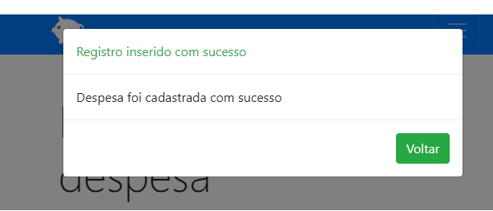

<h1>
   
</h1>

<h1>

</h1>


<h1>

</h1>

<h3>👀 Sobre</h3>

O projeto assistente de despesas é um cadastro de despesas onde pode cadastrar, consultar e acompanhar seus gastos ao longo do ano e assim ter um  melhor controle sobre suas despesas. Foi criado com o intuito de colocar em prática todo o conteúdo que estudei durante um curso complementar. 


<h3>🖥 Tecnologias ultilizadas</h3>


- javaScript
- JQuery
- Bootstrap
- JSON

📂 <h4>Como baixar o projeto</h4>
```bash
#Clonar o repositório
$ git clone https://github.com/jefferson-litiuk/registroDeDespesas.git
#Entrar no diretório 
$ cd registroDespesas
#Instalar as dependências
$ yarn install
#Iniciar o projeto
$ yarn start
```
---
⚒Desenvolvido por Jefferson litiuk🛠